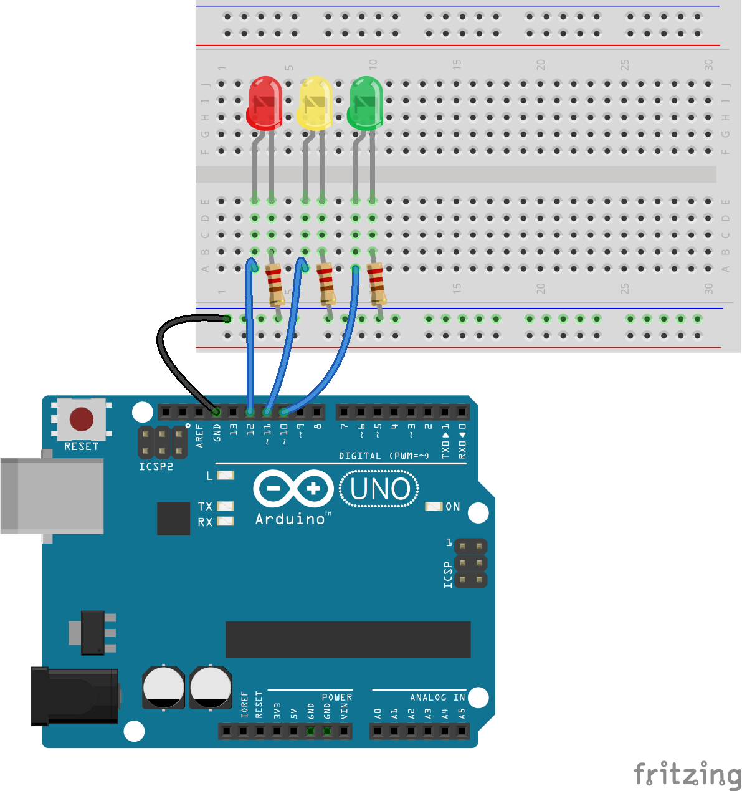

# About

Demonstrates a simple multi-LED setup.

# Setup

### Learning Objectives

- Understand basic LED setup.
- Understand the importance of current-limiting resistors.
- Understand the difference between standard digital output and pulse width modulation (PWM).
- Understand the difference between `void setup() { ... }` vs. `void loop() { ... }`.
- Understand using `pinMode(...)` to configure the pins.
- Understand using `digitalWrite(...)` to output voltage to the configured pins.
- Understand using `delay(...)` to temporarily pause the loop and affect the timing of program execution.

### Expected Behavior

All three LEDs should blink on and off every 1000 milliseconds.

### Instructions for use:

- None

### Other classes used in this file

- None
