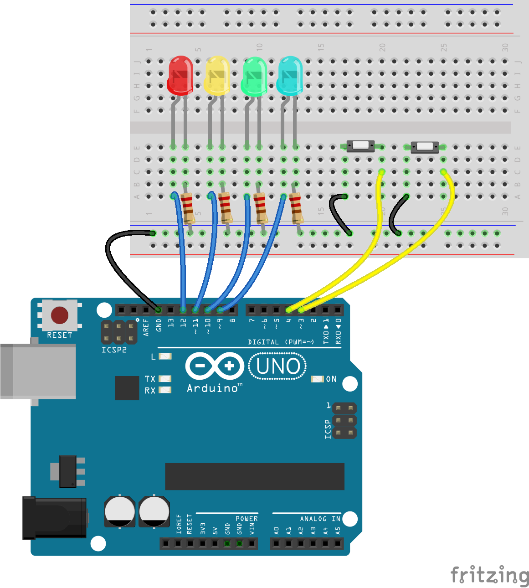

Goal create a game based on the [Reddit Button](https://en.wikipedia.org/wiki/The_Button_(Reddit)

Parts:

- Each player has a button and an LED.
- There is a countdown LED that starts out at full brightness and gets dimmer until it is off.
- When a user presses their button, their LED turns on and the countdown LED resets to full brightness.

- _Note: To fully follow the rules of the Reddit game, each player only gets one press, which makes a two person game a little boring._

The "winner" of the game is the last person to press the button.

This version incorporates two buttons and two LEDs.

Also demonstrates `INPUT_PULLUP` and simple logic.

